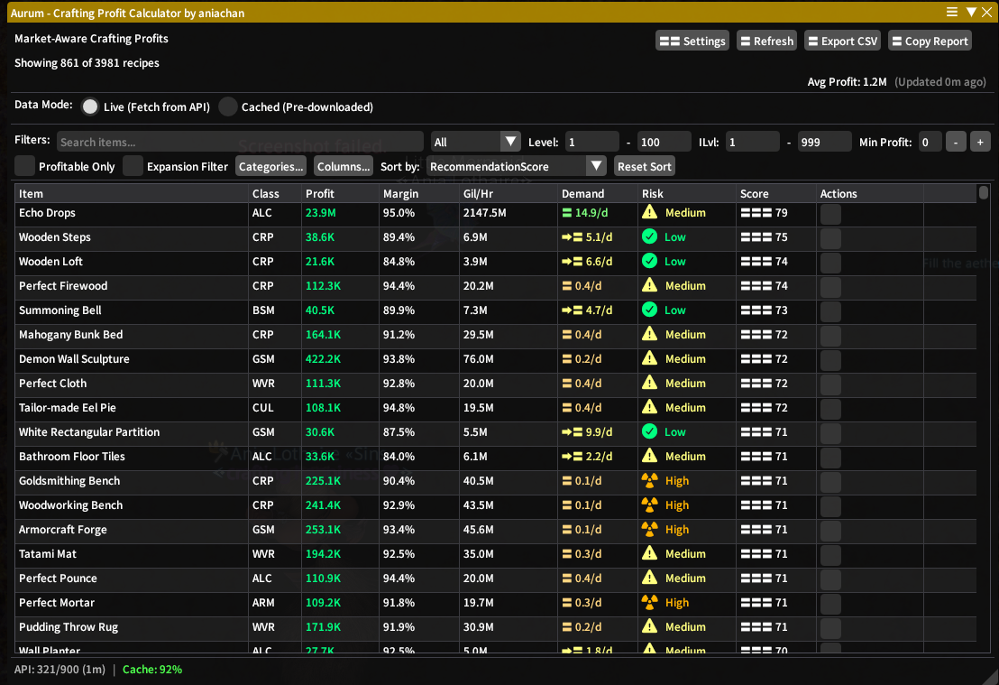
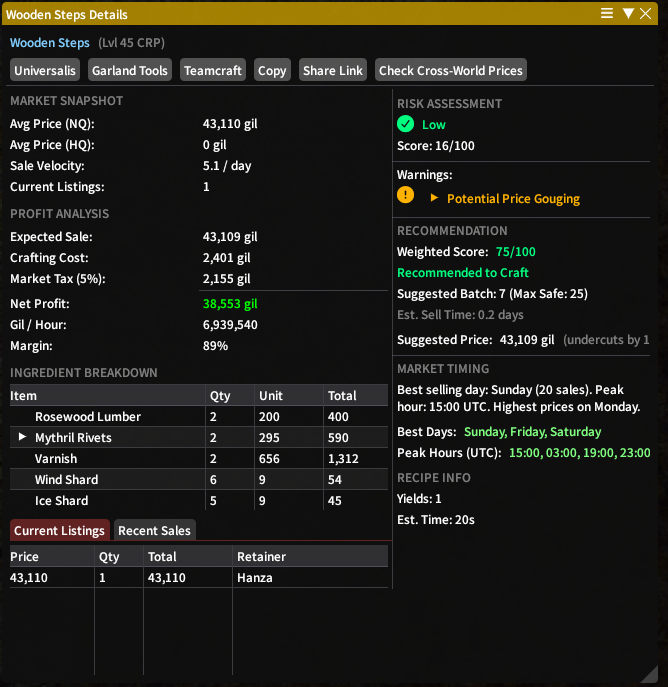

# Aurum

<p align="center">
  
</p>

<p align="center">
  A Dalamud plugin for FFXIV crafters that combines profit calculation with market-demand analysis.
</p>

## Overview

Aurum helps answer a more useful question than "what has the biggest margin?":

"What is worth crafting if I also want it to sell?"

The plugin combines recipe cost calculation with Universalis market data so you can quickly spot:

- Profitable recipes
- Slow-moving or saturated markets
- Risky price-war situations
- Better quantities to craft

## Community

- Ani's Plugins Discord: [https://discord.gg/ydEM74N6SD](https://discord.gg/ydEM74N6SD)

## Screenshots

### Main Dashboard



### Item Details



## Features

- Full crafting-profit calculation, including ingredient trees
- Universalis-backed market analysis
- Demand and sale-velocity signals
- Oversupply and competition warnings
- Risk scoring and recommendation scoring
- Shopping list support
- Configurable filtering for finding better crafts faster

## Installation

### Public Release

If a packaged release is available, install it from the project releases page:

[GitHub Releases](https://github.com/aniachan/Aurum/releases)

### Manual / Development Install

1. Clone the repository.
2. Build the solution:

```powershell
dotnet build Aurum.sln --configuration Release
```

3. Add `Aurum/bin/x64/Release/Aurum.dll` to Dalamud Dev Plugin Locations.
4. Enable the plugin from Dalamud.

## Commands

- `/aurum` opens the main window
- `/aurum config` opens the configuration window

## Project Layout

```text
Aurum/                   Main plugin project
Aurum/Models/            Data models
Aurum/Services/          Market, recipe, cache, and analysis logic
Aurum/Windows/           Dalamud UI windows
Aurum.IntegrationTests/  Integration and UI-oriented tests
Data/                    README assets and plugin imagery
```

## Tech Stack

- .NET 10
- Dalamud SDK 14
- Lumina
- ImGui
- Universalis API
- SQLite via `Microsoft.Data.Sqlite`

## Development Notes

- The plugin manifest lives in [Aurum/Aurum.json](Aurum/Aurum.json).
- Release metadata for custom repos lives in [repo.json](repo.json).
- GitHub Actions workflows for build and release live in [.github/workflows](.github/workflows).

## License

This repository now includes the Creative Commons Attribution-ShareAlike
4.0 International license in [LICENSE](LICENSE).

Official source:
[CC BY-SA 4.0 legal code](https://creativecommons.org/licenses/by-sa/4.0/legalcode.txt)


## Credits

- [Dalamud](https://github.com/goatcorp/Dalamud)
- [Universalis](https://universalis.app/)
- The FFXIV plugin and crafting community
