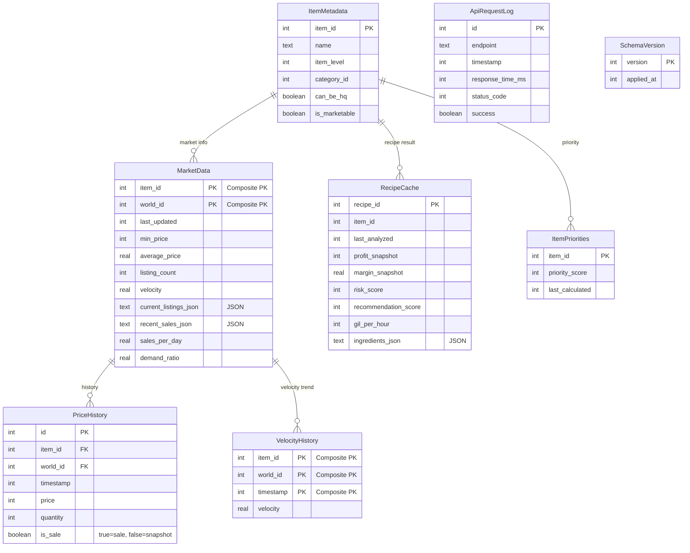

# Database Schema

Aurum uses a local SQLite database (`aurum.db`) to cache market data, track history, and store analysis results. This persistence layer is critical for reducing API calls to Universalis and providing a responsive user experience.

## Entity Relationship Diagram

## Tables Detail

### MarketData
Stores the latest snapshot of market board data for an item on a specific world. This is the primary cache for Universalis data.
- **item_id**: The unique ID of the item (GameData).
- **world_id**: The ID of the world (server).
- **last_updated**: Unix timestamp of when this data was fetched from Universalis.
- **current_listings_json**: JSON array of current listings (prices, retainers).
- **recent_sales_json**: JSON array of recent sales history.

### PriceHistory
Tracks granular price points over time. Used for generating charts and analyzing trends.
- **is_sale**:
  - `true`: Represents a completed transaction (sale).
  - `false`: Represents a snapshot of the minimum listing price at a point in time.

### VelocityHistory
Tracks the "sale velocity" (sales per day) metric over time. This helps identify if an item is becoming more or less popular.

### RecipeCache
Stores the results of profit calculations. Since calculating profit involves traversing ingredient trees and market data, this cache prevents re-calculation for every frame/refresh.
- **profit_snapshot**: Net profit calculated at `last_analyzed`.
- **risk_score**: Calculated risk metric (0-100).
- **recommendation_score**: overall score combining profit, velocity, and risk.

### ItemMetadata
Static or semi-static data about items (Name, Level, Category). Used to avoid constant lookups in Lumina/GameData for basic info.

### ItemPriorities
Stores the "priority score" for items, which determines their order in the dashboard. High priority items are refreshed more frequently.

### ApiRequestLog
Logs outgoing HTTP requests to Universalis. Used for debugging and verifying rate limiter behavior.

### SchemaVersion
Tracks applied database migrations. Used by `DatabaseService` to automatically apply schema updates on startup.
